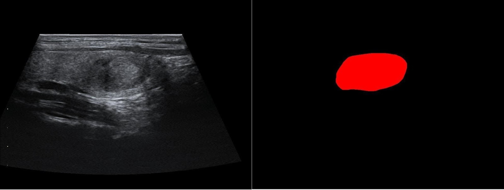
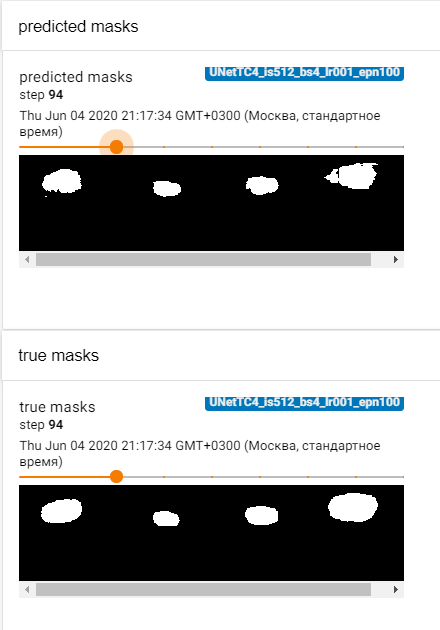
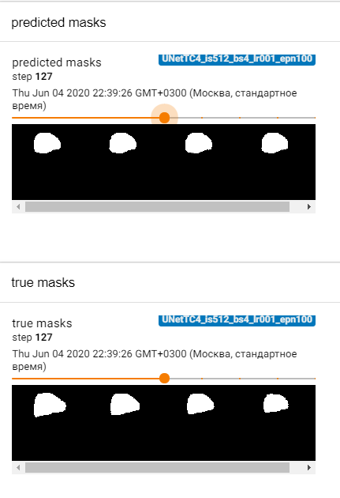
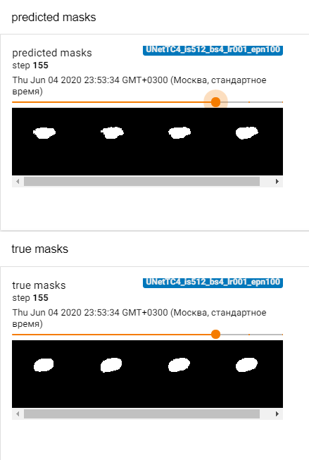
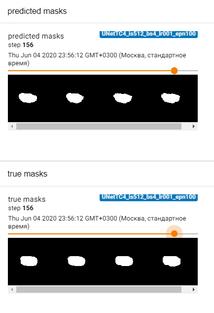

# Thyroid Ultrasound Images Segmentation

## Introduction

With ultrasound, a number of soft-tissues (parenchymal), for example, thyroid
formations can be completely visualized, the state of which has important diagnostic value.
In thyroid the pathology can be diffused (affecting the entire
organ/structure), focal or mixed.
With the development of computer vision technologies, research has become
possible at the junction of the areas of deep learning and biomedicine to solve
such problems as medical image segmentation [[1, 2]](#references).
Today, analysis of thyroid formations is carried out by each doctor personally
and its information content is extremely operator-dependent. Our aim is to
provide them with algorithms that would highlight those formations in 2D US
images.
The ultrasound method is a manual method of arbitrary positioning by the
operator’s hand (hand-free) and, unlike CT and MRI (recording on a disc in
DICOM format), it is not standardized from a tomographic (full organ review)
point of view. At the same time, on modern ultrasonic devices it is possible to
save individual images (ultrasound slices).

## Purpose

Ultrasound is a form of radiation that, like X-rays, is useful for medical imaging
because of a good balance between its penetration of and interaction with the
body [[3]](#references). But the exact physical model of wave propagation through the insides
of a person is still unknown.
The main idea we are planning to implement is to utilize UNet-like model 
combined with Recurrent Neural Networks (RNN) [[4]](#references) in order 
to account for information from neighbor slices. 
There are various approaches to the construction
of such models [[5, 6]](#references).

## Data

Dataset consists of pairs (image, mask): thyroid nodules (2D slices segmented
by experts) from National Center for Endocrinology.



## Method

What makes this project interesting for us is to account for
space information from neighbor (nearest) slices of space. Convolutional neural
networks have shown themselves very well in various tasks of computer vision.
So we have compiled an algorithm that uses the symbiosis of both approaches.

## Usage

### Requirements

The list of required libraries (can be installed by for example `pip install <package name>` or `conda install <package name>`):  

- `crfseg` - [Developed by team “2.5D Neural Networks for Medical Image Segmentation” in similar task](https://pypi.org/project/crfseg/)
- `numpy>=1.18.1`
- `pandas>=0.25.1`
- `pillow>=6.1.0`
- `pytorch>=1.3.1`
- `tensorboard>=2.1.1`
- `torchvision>=0.4.2`
- `opencv-python-headless`


### Prepare data
Raw data should be organized in a following way:   
```
raw_data
│
├───Patient_1
│   │
│   ├───Images
│   │   ├───001.tif
│   │   ├───002.tif
│   │   └─── ...
│   │
│   └───Masks
│       ├───001.labels.tif
│       ├───002.labels.tif
│       └─── ...
│
├───Patient_2
│   │
│   ...
...
```

- To preprocess data run:  

```python data_preprocessing.py --config_file="configs/config_preprocessing.txt"```  

- Where `config_preprocessing.txt` contains (including ":" and "#"):

```
root: <path to git repo> # root
raw data: <raw data> # path to folder relative to the root with raw data
preprocessed data: <data> # path to the folder relative to the root where preprocessed data will be
```

### Train network

- To train the network after preparing your data run this command:  
```python train.py --config_file="config_train.txt"```

- Where `config_train.txt` contains (including ":" and "#"):

```
root: <path to git repo> # root
experiment_name: <Your experiment name> # experiment name, if None default name will be created
image size: <height, width> # model image input size (e.g. 256, 256)
batch size: <batch size> # batch size (e.g. 4)
lr: <learning rate> # learning rate (e.g. 0.001)
epochs number: <epochs number> # number of epochs (e.g. 40)
log dir: <path to log dir> # path to the folder relative to the root where the results of experiments from the tensorboard will be recorded
checkpoint_path: checkpoints/<checkpoint name> # checkpoint path if continue training, else None
```

---
**NOTE**

In file `train.py` you can change models (do not forget to import them if they are not imported already).

---

### Perform inference

Test data should be organized in a following way:   
```
test
│
├───Patient_1
│   │
│   ├───Images
│   │   ├───001.tif
│   │   ├───002.tif
│   │   └─── ...
│   │
│   └───Masks
│       ├───001.labels.tif
│       ├───002.labels.tif
│       └─── ...
│
├───Patient_2
│   │
│   ...
...
```

- To perform inference with the trained network run this command:  
```python inference.py --config_file="configs/config_inference.txt"```

- Where `config_inference.txt` contains (including ":" and "#"):

```
root: <path to git repo> # root
model path: <model.pth> # path to the model relative to the root
image size: <height, width> # model image input size for the loading model (e.g. 256, 256)
test data: <test> # path to the folder relative to the root with test data

```

---
**NOTE**

Model is supposed to be saved by the command ```torch.save(model.state_dict(), best_model_path)```

---


After running the above command folders `Animations` and `Predicted_Masks` will be created in the `test` folder:   
```
test
│
├───Patient_1
│   │
│   ├───Images
│   │   ├───001.tif
│   │   ├───002.tif
│   │   └─── ...
│   │
│   ├───Masks
│   │   ├───001.labels.tif
│   │   ├───002.labels.tif
│   │   └─── ...
│   │
│   ├───Animations
│   │   ├───001.gif
│   │   ├───002.gif
│   │   └─── ...
│   │
│   └───Predicted_Masks
│       ├───001.tif
│       ├───002.tif
│       └─── ...
│
├───Patient_2
│   │
│   ...
...
```

## Examples

- Gif image of prediction for UNetTC4 (UNet triple cat with 4 down steps) model:


- some predicted masks and ground truth masks for the same model:






## References

[1] Song, Junho & Chai, Young Jun & Masuoka, Hiroo & Park, Sun-Won &
Kim, Su-jin & Choi, June & Kong, Hyoun-Joong & Lee, Kyu Eun & Lee,
Joongseek & Kwak, Nojun & Yi, Ka & Miyauchi, Akira. (2019). Ultrasound
image analysis using deep learning algorithm for the diagnosis of thyroid
nodules. Medicine. 98. e15133. 10.1097/MD.0000000000015133.  
[2] Wang, Lei & Yang, Shujian & Yang, Shan & Zhao, Cheng & Tian, Guangye
& Gao, Yuxiu & Chen, Yongjian & Lu, Yun. (2019). Automatic thyroid
nodule recognition and diagnosis in ultrasound imaging with the YOLOv2
neural network. World Journal of Surgical Oncology. 17. 10.1186/s12957-
019-1558-z.  
[3] M. A. Flower. Webb’s Physics of Medical Imaging, Second Edition.  
[4] Le, Truc & Bui, Giang & Duan, Ye. (2017). A Multi-view Recurrent
Neural Network for 3D Mesh Segmentation. Computers & Graphics. 66.
10.1016/j.cag.2017.05.011.  
[5] Azad, Reza & Asadi, Maryam & Fathy, Mahmood & Escalera, Sergio.
(2019). Bi-Directional ConvLSTM U-Net with Densley Connected Convolu-
tions.  
[6] Alom, Md. Zahangir & Hasan, Mahmudul & Yakopcic, Chris & Taha, Tarek
& Asari, Vijayan. (2018). Recurrent Residual Convolutional Neural Network
based on U-Net (R2U-Net) for Medical Image Segmentation.  
[7] Sudre, Carole & Li, Wenqi & Vercauteren, Tom & Ourselin, S´ebastien &
Cardoso, Manuel Jorge. (2017). Generalised Dice overlap as a deep learning
loss function for highly unbalanced segmentations.  